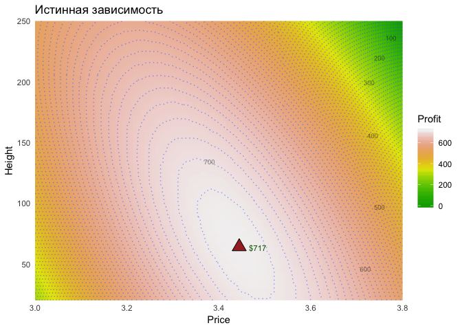
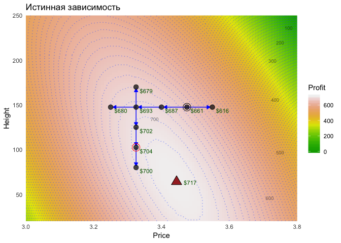
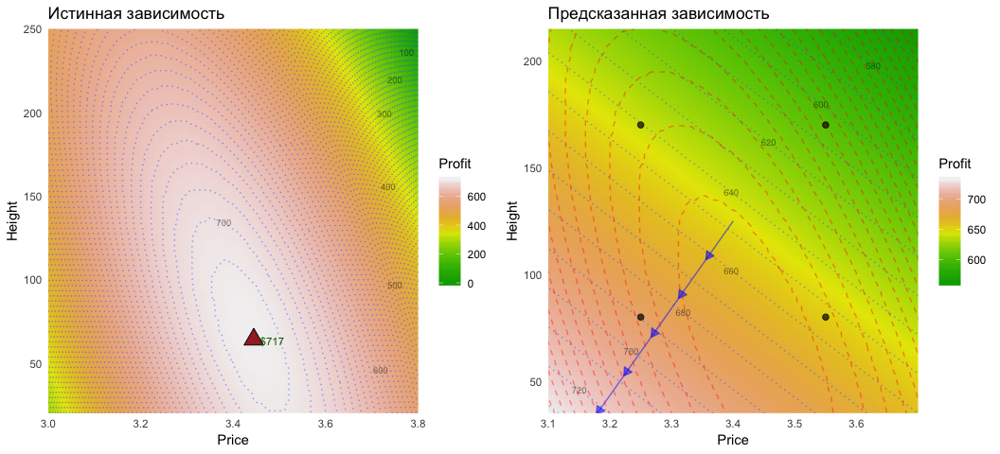
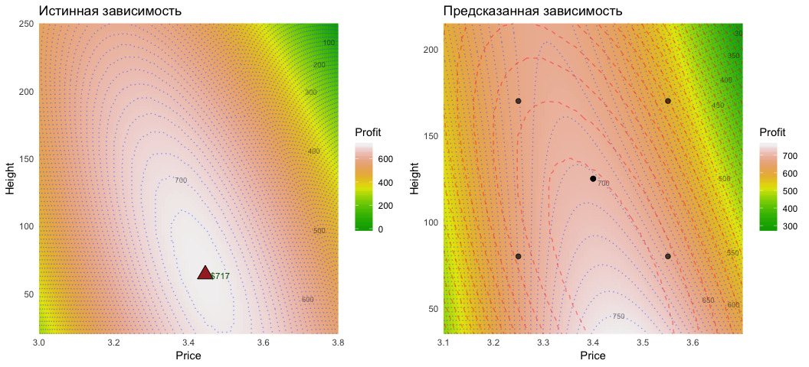
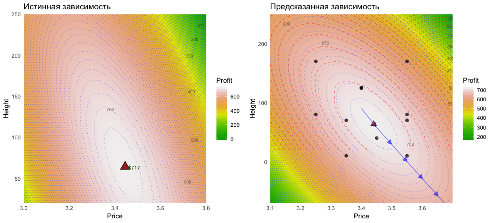
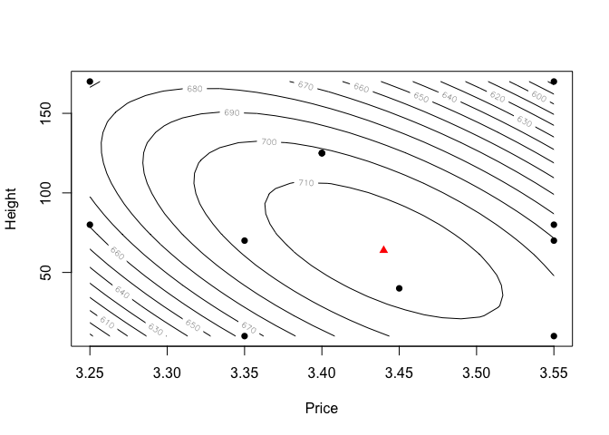

<style>
h1, h2, h3, p, li {font-family: Fira Sans;}
pre.r, code {font-family: source code pro;Fira Sans; background-color: #fdfdfd;}
</style>

# Библиотеки

Загружаем нужные библиотеки


```r
library(tidyverse)
library(magrittr)
library(ggpubr)
library(ggrepel)
library(patchwork)
library(kableExtra)
library(glue)
library(gglabeledcontour)
library(broom)
library(crayon)
library(rsm)
library(pid)
```


# Почему нужен дизайн эксперимента?

Рассмотрим задачу выбора оптимального сочетания на примере. Для этого я выбрал симулятор эксперимента `grocery` из курса PID [[1](https://learnche.org/pid/), [2](https://docs.google.com/document/d/1HbQF94ovmWfJVsBD2XSYQSzowI1-Fy6ztIhExRHedU8/pub)]. В этом эксперименте исследуется зависимость выручки за товар от высоты расположения его на полке в магазине (`Height`) и от его цены (`Price`). Генератор выдает значения для каждого сочетания признаков с небольшим разбросом, имитируя дисперсию реальных значений.

Так выглядит искомая зависимость (но мы этого не знаем). Мы выбираем ту или иную стратегию пространства сочетаний этих двух факторов.


<!-- -->

Задача найти оптимальное сочетание параметров, осуществив как можно меньше переборов.

## Подход перебора условий по каждому признаку отдельно

Обычно мы сначала выбираем оптимальное значение одного признака (при базовых значениях остальных параметров), затем с лучшим из полученных значений.

Допустим, мы начали с базовых условий и начали поднимать, либо опускать цену до тех пор, пока не не увидим падение профита. Когда мы подобрали оптимальную цену, начинаем изменять (вверх и вниз) положение продукта на полке, пока не увидим падение профита. Наблюдаемое при этом максимальное значение профита и будем считать оптимальным сочетанием цены и высоты.

<!-- -->

Оптимальным будет объявлено сочетание Price = 3.325, Height = 102.5, что, как видно из графика, не самое лучшее решение.

## Поиск оптимального значения при помощи дизайна эксперимента

Для начала возьмем 4 точки в наиболее разумные пределах (тех же, что и при переборе), но измерения надо проводить в рандомном порядке.


```
  Price Height LogicalOrder RunOrder Profit
1  3.25     80            1        3    661
2  3.55     80            2        1    682
3  3.25    170            3        2    669
4  3.55    170            4        4    576
```

Теперь строим и анализируем модели. Сравниваем график, на котором показана истинная зависимость, с графиком, содержащим предсказанную зависимость (на ней красным пунктиром помечены контурные линии истинной зависимости).

<!-- -->

Из трех моделей (FO - линейная комбинация факторов, FO+TWI - то же + взаимодействия, SO=FO+TWI+PQ - то же + квадраты значений) лишь самая (FO) простая оказалась применима (см. _adjusted $R^2$_) 


```r
models
```

```
# A tibble: 3 x 3
  formula                                       model         AdjR
  <chr>                                         <list>       <dbl>
1 Profit ~ FO(Price,Height)                     <S3: rsm>   -0.403
2 Profit ~ FO(Price,Height) + TWI(Price,Height) <S3: rsm> -Inf    
3 Profit ~ SO(Price,Height)                     <S3: lm>  -Inf    
```

Вывод: нелинейность взаимосвязи не получилось уловить. Это может быть либо из-за недостаточного количества точек, либо из-за удаления от точки максимума... либо ее вообще могло не быть. Зато, на основе линейных

Хорошим правилом является использование центроида (точки с усредненными по всем факторам значениями). А лучше делать три реплики центроида, чтобы еще получить представление о величине разброса значений. Добавим эти точки и посмотрим, как изменилось предсказание.


```
  Price Height LogicalOrder RunOrder Profit
1   3.4    125            5        5    704
2   3.4    125            6        6    704
3   3.4    125            7        7    698
```

<!-- -->


Добавим еще набор точек, исходя из графика (ибо лучшая модель не смогла построить кратчайший путь).


```
  Price Height LogicalOrder RunOrder Profit
1  3.45     40            8        8    715
2  3.35     10            9        9    665
3  3.35     70           10       10    700
4  3.55     10           11       11    700
5  3.55     70           12       12    696
```

<!-- -->

В итоге мы нашли оптимальное значение. Из-за разброса полученных значений наши предсказания могут немного варьировать. Это можно посмотреть по точности предсказания (интервалы предсказания).


```
       fit      lwr     upr
1 716.5372 706.6623 726.412
```


# Основные принципы дизайна эксперимента

* менять нужно сразу все параметры, т.к. возможно взаимодействие между ними (разный характер влияния одного фактора для разных уровней другого)
* необходимо измерять запланированные точки в случайном порядке, дабы минимизировать влияние неизвестных факторов, которые могут меняться от эксперимента к эксперименту; также полезно замечать все те переменные, которые могли меняться, но не относятся к области нашего интереса (например, день/оператор/прибор), чтобы учесть эти переменные для уточнения модели (blocking variables)
* существует великое множество подходов для выбора точек
  * для перебора большого количества факторов с целью найти ключевые (скрининг) подходят дизайны типа "частичный факториал", при которых нельзя сделать хорошие предсказания и сделать далеко идущие выводы о взаимодействии факторов, но можно отсеять ненужные
  * наиболее точное предсказание позволяет дать дизайн "полный факториал" с центроидами и стар-пойнтами, который стоит применять в случае, когда уже ясно, какие факторы нужны и надо максимально точно оценить положение оптимального сочетания параметров
* в дизайнах типа "частичный факториал" из-за небольшого количества данных и особенностей кодирования переменных для линейной регрессии и дисперсионного анализа смешиваются между собой простые эффекты и более сложные, поэтому приходится исходить из предположения, что квадратичные эффекты и эффекты взаимодействия незначительны

# Использование стандартных функций пакетов `rsm` и `pid`

* выбор дизайна (набора точек и их порядка) для эксперимента - `FrF2::FrF2()`
* проведение эксперимента в определенном порядке
* кодирование данных (абсолютные значения факторов переводим в диапазон от -1 до +1)
* построение моделей (`rsm()`, `lm()`)


```r
# возьмем в качестве данных финальный набор точек из рассмотренного примера
d = round2
d %>% head()
```

```
  Price Height LogicalOrder RunOrder Profit
1  3.25     80            1        3    661
2  3.55     80            2        1    682
3  3.25    170            3        2    669
4  3.55    170            4        4    576
5  3.40    125            5        5    704
6  3.40    125            6        6    704
```

```r
# для линейной регрессии необходимо сперва закодировать наши переменные
# 1. для начала найдем крайние значения признаков
d.extremes = data.frame(n = 1:2)
d.extremes[["Price"]] = range(d[["Price"]])
d.extremes[["Height"]] = range(d[["Height"]])
# 2. генерируем систему кодирования крайних значений -> (-1, 1)
d.codeddata = d.extremes %>% select(-n) %>% coded.data()
```

```
Warning in coded.data(.): Automatic codings created -- may not be what you
want
```

```r
d.coding = d.codeddata %>% codings()
# 3. проводим кодирование данных (создаем объект класса coded.data)
d.enc = d %>% val2code(d.coding)
attr(d.enc, "codings") = d.coding
attr(d.enc, "rsdes") = attr(d.codeddata, "rsdes")
class(d.enc) = c("coded.data", "data.frame")
d.enc %>% head() # полученный объект
```

```
  Price Height LogicalOrder RunOrder Profit
1  3.25     80            1        3    661
2  3.55     80            2        1    682
3  3.25    170            3        2    669
4  3.55    170            4        4    576
5  3.40    125            5        5    704
6  3.40    125            6        6    704

Data are stored in coded form using these coding formulas ...
x1 ~ (Price - 3.4)/0.15
x2 ~ (Height - 90)/80
```

```r
d.enc %>% as.data.frame() %>% head() # а вот как эта таблица на самом деле выглядит
```

```
  x1      x2 LogicalOrder RunOrder Profit
1 -1 -0.1250            1        3    661
2  1 -0.1250            2        1    682
3 -1  1.0000            3        2    669
4  1  1.0000            4        4    576
5  0  0.4375            5        5    704
6  0  0.4375            6        6    704
```

```r
# строим модель взаимоствязей, используя названия кодированных переменных в формуле
model_SO = rsm(Profit ~ SO(x1, x2), data = d.enc) # модель: линейные предикторы, вз-я, квадраты
model_SO %>% glance() # качество
```

```
# A tibble: 1 x 11
  r.squared adj.r.squared sigma statistic p.value    df logLik   AIC   BIC
*     <dbl>         <dbl> <dbl>     <dbl>   <dbl> <int>  <dbl> <dbl> <dbl>
1     0.995         0.990  3.66      227. 9.45e-7     6  -28.4  70.9  74.2
# ... with 2 more variables: deviance <dbl>, df.residual <int>
```

```r
model_SO %>% summary() # все параметры
```

```

Call:
rsm(formula = Profit ~ SO(x1, x2), data = d.enc)

            Estimate Std. Error  t value  Pr(>|t|)    
(Intercept) 713.9608     1.8036 395.8616 1.754e-14 ***
x1            5.5131     1.6192   3.4049 0.0144088 *  
x2          -11.2759     1.7324  -6.5089 0.0006266 ***
x1:x2       -51.4253     2.2407 -22.9509 4.483e-07 ***
x1^2        -41.8827     2.5141 -16.6591 2.985e-06 ***
x2^2        -38.2209     2.6112 -14.6374 6.383e-06 ***
---
Signif. codes:  0 '***' 0.001 '**' 0.01 '*' 0.05 '.' 0.1 ' ' 1

Multiple R-squared:  0.9947,	Adjusted R-squared:  0.9904 
F-statistic: 227.3 on 5 and 6 DF,  p-value: 9.452e-07

Analysis of Variance Table

Response: Profit
            Df Sum Sq Mean Sq  F value    Pr(>F)
FO(x1, x2)   2 3254.9  1627.4 121.7074 1.392e-05
TWI(x1, x2)  1 3687.3  3687.3 275.7528 3.042e-06
PQ(x1, x2)   2 8253.3  4126.6 308.6105 8.923e-07
Residuals    6   80.2    13.4                   
Lack of fit  4   56.2    14.1   1.1715    0.5088
Pure error   2   24.0    12.0                   

Stationary point of response surface:
        x1         x2 
 0.2663989 -0.3267253 

Stationary point in original units:
   Price   Height 
 3.43996 63.86197 

Eigenanalysis:
eigen() decomposition
$values
[1] -14.27409 -65.82958

$vectors
         [,1]       [,2]
x1  0.6815326 -0.7317878
x2 -0.7317878 -0.6815326
```

```r
experimental_points = 
  model$data %>% 
  code2val(codings(model$data))

stationary_point = 
  model %>% 
  summary() %>% 
  .$canonical %>% 
  .$xs %>% 
  code2val(codings(model$data)) %>% 
  t() %>% 
  as.data.frame()

contour(model_SO, ~ x1 + x2)
points(experimental_points, pch=16)
points(stationary_point, pch=17, col="red")
```

<!-- -->
