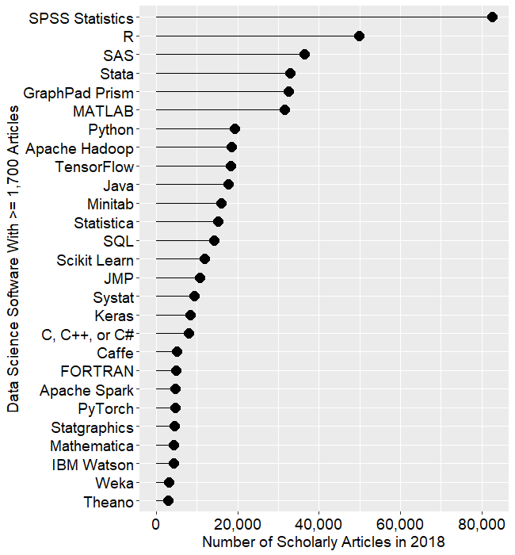
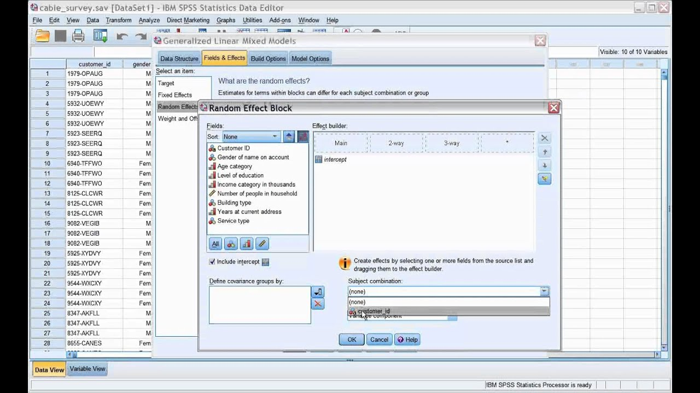

Практикум по статистике для биохимиков #1
========================================================
author: 
date: 
autosize: true

========================================================

<!--
---
title: "Практикум по статистике для биохимиков #1"
output: 
  ioslides_presentation
---
-->
<style>
body slides > slide
{
  height: 900px;
  width: 1300px;
  margin-top: -450px;    /* half of height */
  margin-left: -650px;
}
</style>


## Почему R?

* бесплатно (для сравнения, IBM SPSS $8,540.00 USD / year)
* стандарт статистического анализа
* все новые методы имеют реализации в `R`
* все серьезные программы имеют скриптовый язык

{width=450px}

========================================================

## Окошки или коммандная строка?

{width=1100px}

```r
my_model = lmer( extro ~ open + agree + social + (1|school), data=lmm.data )
```
